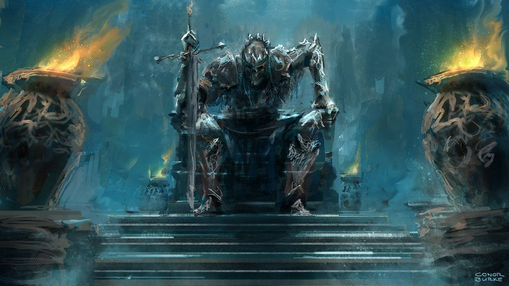
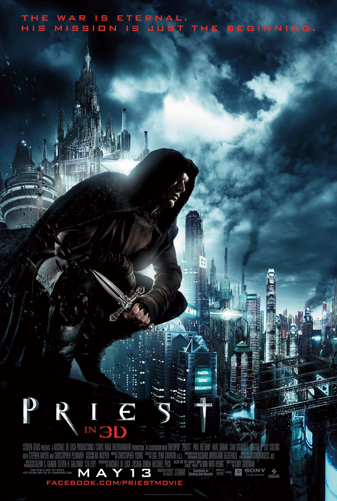
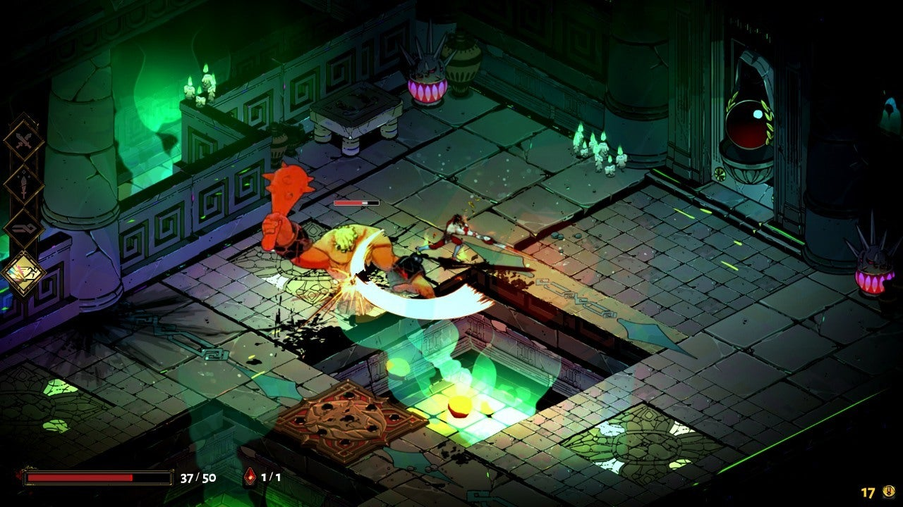
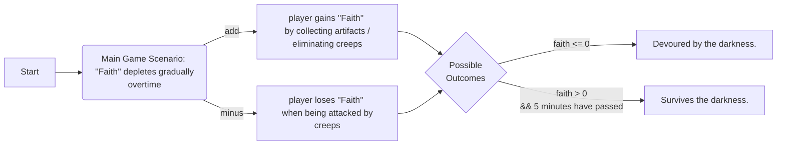
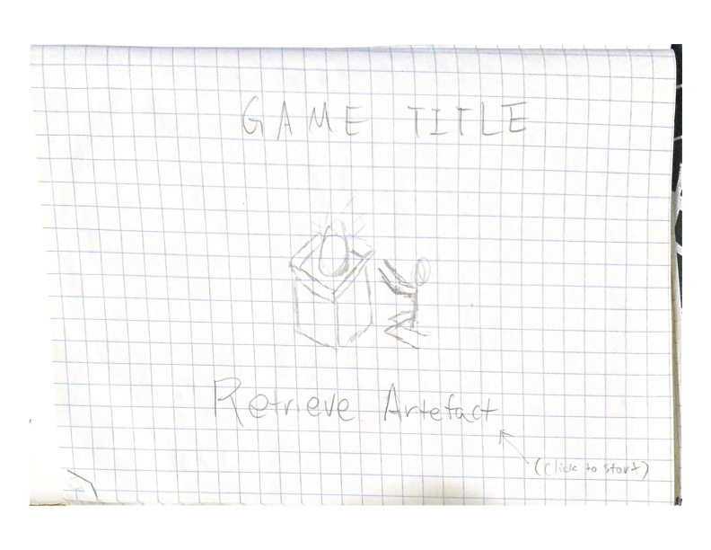
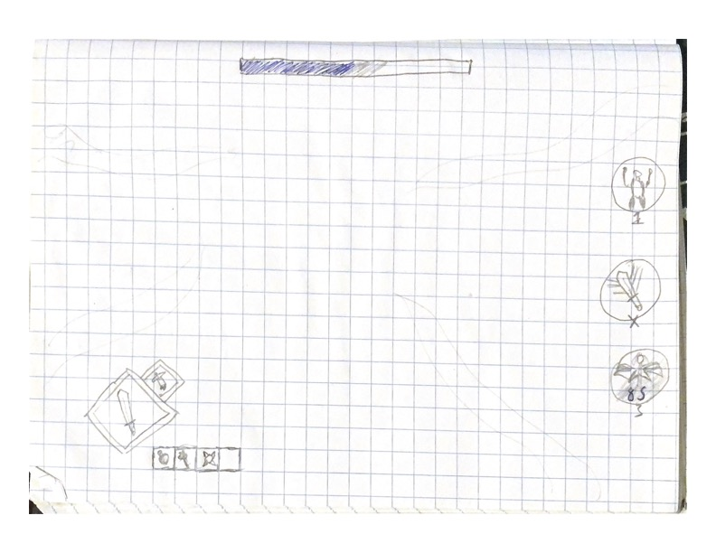
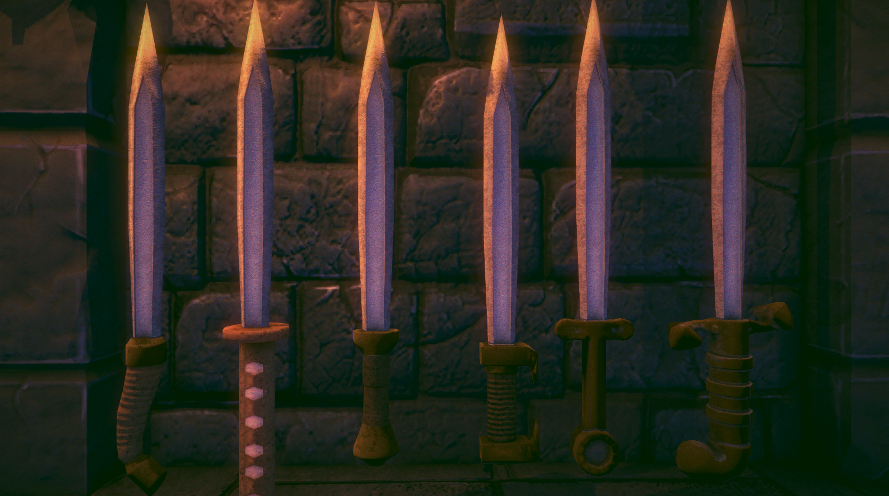

# Game Design Document

This is a placeholder for the GDD. Your team should replace the content of this
file with your own GDD from project 1, and continue to maintain it as discussed
in the project specification. 

Please **do not** update the repository from project 1, all updates to the GDD
going forward should be made to this file. **Make sure that you keep this file
named `GDD.md` and don't move it from the root directory of the repository.**

### Table of contents 

* [Introduction :scroll:](#Introduction)
* [Story and Narrative :book:](#Story-and-Narrative) 
* [World Degisn and Progression :earth_asia:](#World-Design-and-Progression)
* [Controls and Mechanics :video_game:](#Controls-and-Mechanics)
* [User Interface :computer:](#User-Interface)
* [Art and Audio :notes:](#Art-and-Audio)
* [Technology and Tools :sunglasses:](#Technology-and-Tools)
* [Team Communication, Timelines and Task Assignment :couple:](#TCTTA) 
* [Possible Challenges :warning:](#Possible-Challenges)
* [References :open_file_folder:](#References)

Free free to play the music while inspecting our draft and get a taste of the general vibe of our proposed game!! :yum:

https://github.com/COMP30019/project-1-open-heimer-mid/assets/130320442/40e3153b-5bbc-4ddf-a7a5-c10fd8e84e3e

(^ InsertListeningToMusicCrying.gif )

Credit: Vasco Grossmann via Unity Asset Store

[^Find its Reference (1)](#References)

### Introduction :scroll: 

_Before Dawn: the Land in Obscurity_ (we may or may not change this :cowboy_hat_face:) is a fantasy, time survival game set in a **medieval** environment, where you will serve as a faithful explorer under The Divine Order, a sacred organisation that has long sought to gather **artefacts** of immense divine cleansing powers, that will aid in their cause. However, just like any good things in life, acquiring these powerful relics is no simple task, especially when they are scattered across a continent that has been long terrorised under the shadow the Dark Lord, with his malevolent gaze over your shoulder... Being ever watchful.

> "I am actually going to cry if you are not hyped by this."  - tolbertowski

[Back to Top :top:](#Back-to-Top)

### Story and Narrative :book: 

**Backstory**: Diving beneath the surface of a seemingly simple battle of good versus evil, players uncover a more intricate tapestry of deceit. The God hailed as a beacon of the Divine Order, is in a power struggle with the Dark Lord. Rather than a pure-hearted quest, the hero is gradually influenced by the darkness and even starting to question the deity that only seeks territorial expansion and faith propagation, no  matter the cost. 

The player is just like a reminiscent of Sisyphus from the Greek myth, trapped in a repetitive cycle. Every failure leads to a time reversal, and the hero faces the same daunting 5 minutes, with their past memories erased by god's holy power, leaving only the player aware of previous defeats. As the brief window of dawn approaches, the hope it brings is ephemeral. This continuous loop isn't merely gameplay but symbolises life's fleeting nature, challenging perceptions of heroism and morality.

<figure>
  
  <figcaption> Figure 1: A general feel for the lore of our game. </figcaption>
</figure>

Credit: Conor Burke

[^ Find its Reference (2)](#References)

**Characters**: 

While we have not completely modelled our hero, we feel like they will be somewhat similar to the character shown in the poster below.   

<figure>
  
  <figcaption> Figure 2: A hint of what our main character will look like </figcaption>
</figure>

Credit: The Priest (2011)

[^ Find its Reference (3)](#References)

but there are also the god revered by The Divine Order, the opposing Dark Lord, and his dark forces.

[Back to Top :top:](#Back-to-Top)

### World Degisn and Progression :earth_asia:

**World Design**: Players will experience the game from a third-person perspective, that can be roughly described to have a **2.5D** point of view you'd find in games like _Hades_ and _V Rising_. 

This allows the player to see the protagonist in full. The camera dynamically tracks the character, ensuring the character to remain centered in the frame (or at an approximately central position). As the character transitions into a new map segment, the camera shall seamlessly follows. Additionally, during specific actions like combination moves or when the character takes heavy damage, players might notice subtle camera shakes or brief zoom-ins to amplify immersion and emphasise the impact.

<figure>
  
  <figcaption> Figure 3: Sample gameplay screenshot of Hades </figcaption>
</figure>
Credit: Hades

[^ Find its Reference (4)](#References)

**Progression**: In our game, as the player steps into the dark and faces off against the gravest threats and danger of darkness right before dawn. The win condition? Staying true to yourself in the dark. Surviving until dawn breaks (a span of 5 minutes), when light bathes the earth once more. When this occurs, the creeps that thrive in the dark, will burst into fireworks under the sun's rays, just like the vampires in _The Thirst_, or the mobs in _Minecraft_ (but potentially in a cooler way!)

**~~Faith~~** (Unique Selling Point): With the above in mind, we would like to introduce a **"Faith"** value, which represents/replaces the player's health bar. As the game commences, the "Faith" value will start to **deplete gradually** as the hero is influenced psycological by the Dark Lord, and even **more heavily** when being attacked by the dark creatures. <u>If it depletes completely, the game is over</u>. 

While rate of the **depletion is** **paced reasonably**, it is timed to reach zero before the five-minute mark. This design implies that players cannot win the game by simply playing hide-and-seek with the mobs, that should they choose to do nothing, their Faith Value will reach zero before daylight comes, resulting in assimilation by the Dark Lord. 

However, by defeating enemies or interacting with specific items or terrain (primarily the divine artefacts), players can reinforce their "Faith". Given the continuous decrease in their Faith Value, players are perpetually pressed for time, **pushing them to be proactive** in their gameplay approach.

^ A simple flowchat of one cycle of the game, whether the player will be 

[Back to Top :top:](#Back-to-Top)

### Controls and Mechanics :video_game:

**Controls**:  We're aiming for this title to deliver a **punchy feel** resembling top-tier arcade fighting game (very ambitious :flushed:). With this in mind, the game should support both keyboard /gamepad inputs. For the keyboard setup, players can expect to navigate using the **WASD** keys and attack, combo, or deploy items/skills with **JK** **123**(tentatively). The purpose of this design is to ensure that players can comfortably place both hands in the appropriate positions while using the keyboard. Additionally, the game allows players to use the **QE** keys to switch between different camera perspectives, ensuring that no game objects are hidden in blind spots. This design choice enhances the overall player experience, providing a more seamless and engaging gameplay.

**Mechanics**: At its core, our game can be described as a roguelike combat survival game. Each foray into the game might place the player in diverse environments, thanks to our modular map designs. As gameplay progresses, players are offered the chance to adopt randomised special abilities or attribute boosts, ensuring every session feels fresh and unique, driving replayability. This gameplay mechanic is seamlessly woven into our game's lore: God bestows random divine gifts upon his faithful worshipper, aiding them in their battle against the Dark Lord.

Due to time constraints, the final version of the game does not showcase a vast array of skills available for random selection (we have narrowed it down from five to three different types of skills). However, our code implementation is highly scalable, allowing for easy updates in future version releases.

Our intention is for players to acquire three random skills as the game progresses, each originating from three distinct skill groups: 

1. **Recovery Skills:** These skills restore the player's state.
2. **Enhancement Buff Skills:** These skills boost various player stats.
3. **Special Effects Skills:** These skills trigger unique effects, such as pushing enemies away.

In the current version, these three skills are predetermined, but the order in which they are acquired is randomized, introducing a level of unpredictability and variety to each gameplay experience. This design ensures that players can enjoy a diverse range of strategies and outcomes, keeping the game fresh and engaging.

[Back to Top :top:](#Back-to-Top)

### User Interface :computer:

**Menu**:Currently, players are presented with three options in the game:

1. **Start Game:** This option takes the player directly into the game, allowing them to immediately begin playing.
2. **Controls:** This section provides players with the opportunity to observe and learn the game’s controls and mechanics, ensuring they are familiar with how to play before starting.
3. **Settings:** Here, players can adjust various aspects of the game, such as its difficulty level, to tailor the gameplay experience to their preferences.

<figure>
  
  <figcaption> Figure 4: A sketch of our menu UI </figcaption>
</figure>

**In-game**: It will most likely resembles an in-game interface of traditional arcade titles, showing infomation of player's "Faith", abilites and attributes they picked up.
We have incorporated a variety of lively and dynamic effects into this part of the game to enhance the player’s experience:

1. **Health Bar Vibration:** When the player’s health decreases, the health bar vibrates to visually emphasize the impact and create a sense of urgency.
2. **Skill Description Displacement:** The descriptions for skills exhibit a subtle displacement effect, making them more noticeable and engaging for the player.
3. **Combat UI Interface:** The battle UI interface is designed to appear only when the player enters the game and starts moving, ensuring a clean and uncluttered screen when it is not needed.

These features contribute to a more immersive and interactive gaming experience, drawing the player into the world of the game and making each action and event feel more impactful.

<figure>
  
  <figcaption> Figure 5: A sketch of our in-game UI </figcaption>
</figure>

[Back to Top :top:](#Back-to-Top)

### Art and Audio :notes:

Potentially something to be played when it is close to reach dawn (the win condition).

<video src="/Users/tolbertowski/Documents/GitHub/project-1-open-heimer-mid/Audios/hurry_percussion_only_loop.mov"></video>

Credit: Vasco Grossmann via Unity Asset Store

[^Find its Reference (1)](#References)

With a medieval settings in mind, a potential choice of our weapons.

 <figure>
  
  <figcaption> Figure 5: Potential choice of weapons </figcaption>
</figure>

Credit: White Pills Games

[^Find its Reference (5)](#References)

[Back to Top :top:](#Back-to-Top)

### Technology and Tools :sunglasses:

- Unity + WebGL build
- Github Desktop 
- Blender for UI
- Free assets on Unity Asset Store
- Google Docs + Drive to share ideas and resources 
- Typora for documentations 

[Back to Top :top:](#Back-to-Top)

### Team Communication, Timelines and Task Assignment :couple:

- Weekly touch base team meetings on campus during workshop time

- Extra meetings and communications on discord.

  **Week 6**: Prototype - model characters, implement controls and basic game mechanics

  **Week 7**: Combat system - model creeps, implement basic combat mechanics

  **Week 8**: Modular Map System - model assets on the map and implement asset interactions

  **Week 9**: Sample game life cycle - Implement a basic game cycle

  **Week 10**: Implement advanced game attributes - randomised 

  **Week 11** - **SWOTVAC** : Deploy a playable game, bug fixing - final polishing of game

  

[Back to Top :top:](#Back-to-Top)

### Possible Challenges :warning:

- **The rendering of lighting/shadows in a 2.5D environment**

  Possible solution: learn from and research lecture and workshop materials

- **Path finding algorithm for creeps**

  Possible solution: mimic behaviour of ghosts in pac-man

- **Smooth incorporation of background music** 

  Possible solution: attempt multiple times until the music incorporates perfectly with in-game event

- **MORE CHALLENGES TO BE IDENTIFIED AND UPDATED AS WE PROGRESS INTO INPLEMENTATION**

[Back to Top :top:](#Back-to-Top)

### References :open_file_folder:

1. Vasco Grossmann via Unity Asset Store https://assetstore.unity.com/packages/audio/music/orchestral/fantasy-music-lite-72931
1. Conor Burke via pinterest https://www.pinterest.com.au/pin/365143482269291250/
1. The Priest (2011) via imdb https://www.imdb.com/title/tt0822847/
1. Hades via IGN https://www.ign.com/games/hades/gameplay
1. White Pills Games https://whitepillsgamesinc.itch.io/lowpolyswordfantasy

Need more help? Check out these resources, which everything in this document is based on:

* [GitHub Flavoured Markdown](https://guides.github.com/features/mastering-markdown/) (official guide)
* [GitHub LaTeX](https://docs.github.com/en/get-started/writing-on-github/working-with-advanced-formatting/writing-mathematical-expressions)
* [GitHub Diagrams](https://docs.github.com/en/get-started/writing-on-github/working-with-advanced-formatting/creating-diagrams) 
* [Mermaid Docs](https://mermaid-js.github.io/mermaid/#/)
* [Mermaid Live Editor](https://mermaid-js.github.io/mermaid-live-editor/)
* [Emoji Picker](https://github-emoji-picker.rickstaa.dev/)